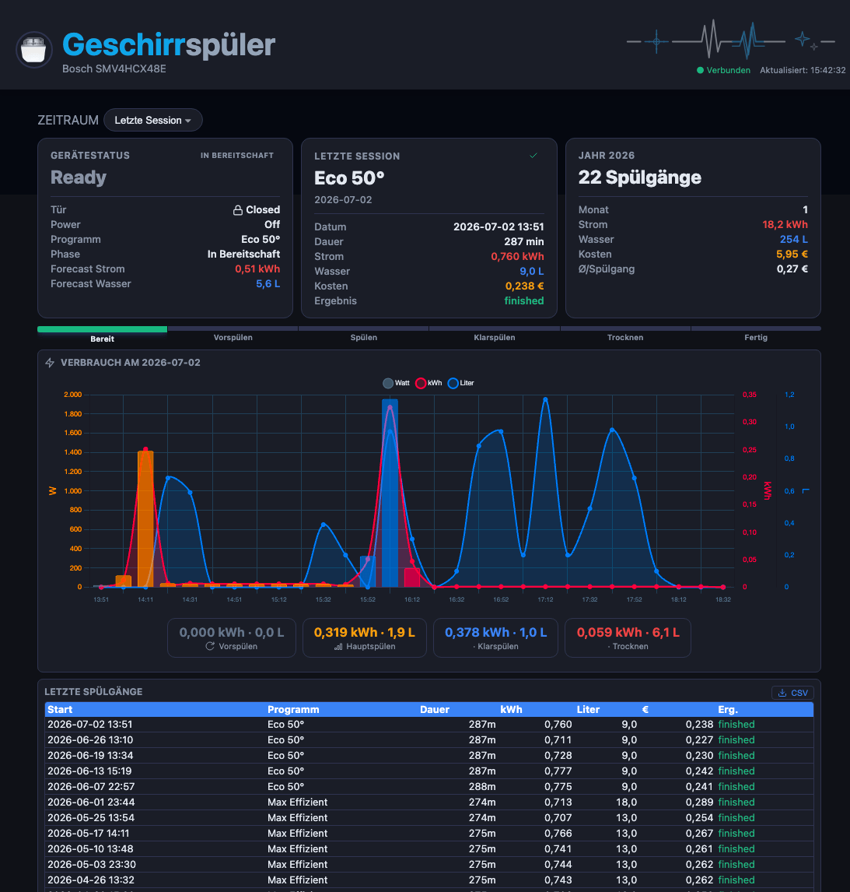

# hc_bosch – Bosch Home Connect Dashboard

[](https://github.com/zibous/hc_bosch/releases)
[](https://github.com/zibous/hc_bosch)
[](https://python.org)
[](https://fastapi.tiangolo.com)
[](https://docs.pydantic.dev)
[](https://hub.docker.com)
[](https://sqlite.org)
[](https://www.chartjs.org)
[](#)
[](#)
[](#)
[](#)
[](https://www.buymeacoff.ee/zibous)

Local network bridge for Bosch-Siemens Home Connect appliances → MQTT → Home Assistant.
FastAPI-basiertes Dashboard mit Echtzeit-Session-Tracking und Verbrauchsanalyse.



## Application Workflow

```
┌─────────────────────────────────────────────────────────────────────────┐
│                            main.py (Entry)                              │
└────────┬──────────────────────┬─────────────────────────┬───────────────┘
         │                      │                         │
         ▼                      ▼                         ▼
┌─────────────────┐  ┌──────────────────────┐  ┌──────────────────────┐
│  FastAPI Server │  │  MQTT WebSocket Feed │  │  Sensor Publisher    │
│  (Port 5021)    │  │  (Bosch Appliance)   │  │  (30s aktiv/120s)    │
└────────┬────────┘  └──────────┬───────────┘  └──────────┬───────────┘
         │                      │                         │
         │                      ▼                         │
         │           ┌──────────────────────┐             │
         │           │   State Manager      │             │
         │           │   (data2mqtt.py)     │◄────────────┘
         │           └─────┬──────────┬─────┘
         │                 │          │
         │                 ▼          ▼
         │     ┌────────────────┐  ┌──────────────────┐
         │     │ status.json    │  │ Session Tracker  │
         │     │ (Persist)      │  │ (Start/End)      │
         │     └────────────────┘  └────────┬─────────┘
         │                                  │
         ▼                                  ▼
┌─────────────────────────────────────────────────────────┐
│                    SQLite DB                            │
│  sessions │ daily_summary │ state_log │ session_readings│
└─────────────────────────────────────────────────────────┘
         │                                  │
         ▼                                  ▼
┌──────────────────┐              ┌──────────────────────┐
│  REST API        │              │  MQTT Broker         │
│  /api/live       │              │  HA Discovery        │
│  /api/daily      │              │  Heartbeat           │
│  /api/sessions   │              │  Sensor Data         │
│  /api/kpidata    │              └──────────────────────┘
└────────┬─────────┘                        │
         │                                  ▼
         ▼                        ┌──────────────────────┐
┌──────────────────┐              │  Home Assistant      │
│  Web Dashboard   │              │  Webhook Events      │
│  (Frontend SPA)  │              └──────────────────────┘
└──────────────────┘

MQTT_HOST=disabled → Nur Dashboard + DB (kein WebSocket, kein MQTT)
```

## Features

- FastAPI mit automatischer OpenAPI-Dokumentation (`/docs`)
- Lokale WebSocket-Verbindung zu Home Connect Geräten (kein Cloud-Polling)
- MQTT Publishing mit HA Discovery (optional, deaktivierbar)
- Web Dashboard (SPA) mit Periodenauswahl, Live-Session-Chart, Kosten
- Echtverbrauchsmessung via externe Sensoren (Sonoff Pow + ESP32 Wasseruhr)
- SQLite-Datenbank für Session-Historie und Tages-/Monatssummen
- KPI-Endpoint für zentrales Übersichts-Dashboard
- Offline-Modus (`MQTT_HOST=disabled`) – nur Dashboard + DB
- Graceful Shutdown (SIGINT/SIGTERM)
- Docker-ready

## Quick Start

```bash
# Docker
cp .env.example .env
nano .env                    # MQTT + Bosch-Credentials setzen
make build && make up
# → http://localhost:5021

# Lokal
pip install -r requirements.txt
python3 main.py
```

## Configuration (`.env`)

| Variable | Default | Beschreibung |
|----------|---------|--------------|
| `MQTT_HOST` | `disabled` | MQTT Broker (`disabled` = nur Dashboard) |
| `MQTT_PORT` | `1883` | MQTT Port |
| `MQTT_USER` / `MQTT_PASS` | – | MQTT Auth (leer = keine) |
| `MQTT_TOPIC_BASE` | `bosch-dishwasher` | Basis-Topic |
| `DASHBOARD_PORT` | `5021` | Web Dashboard Port |
| `BOSCH_EMAIL` / `BOSCH_PASSWORD` | – | Cloud-Login (nur erstmalig) |
| `SENSOR_WATER_URL` | – | ESPHome Wasseruhr URL |
| `SENSOR_ENERGY_URL` | – | Sonoff Pow (Tasmota) URL |
| `HA_WEBHOOK_URL` / `HA_WEBHOOK_ID` | – | HA Webhook (optional) |
| `FORECAST_ENERGY_MAX_KWH` | `1.05` | 100% Forecast Basis kWh |
| `FORECAST_WATER_MAX_L` | `13.0` | 100% Forecast Basis Liter |
| `LOG_LEVEL` | `INFO` | Logging Level |
| `SAVE_SESSIONS` | `true` | Session-CSV speichern |
| `SESSIONS_KEEP` | `10` | Max Session-Dateien |

## API Endpoints

| Endpoint | Beschreibung |
|----------|--------------|
| `GET /api/health` | Healthcheck |
| `GET /api/status` | Aktueller Gerätezustand |
| `GET /api/live` | Live-Status + Tagesverbrauch + letzte Session |
| `GET /api/session/live` | Live-Chart-Daten der aktuellen/letzten Session |
| `GET /api/daily?days=30` | Tägliche Zusammenfassung |
| `GET /api/daily?from=&to=` | Tages-Zusammenfassung für Datumsbereich |
| `GET /api/monthly?year=2026` | Monatliche Zusammenfassung |
| `GET /api/sessions?limit=50` | Session-Liste |
| `GET /api/years` | Verfügbare Jahre |
| `GET /api/stats` | Gesamt-Statistiken mit Kosten |
| `GET /api/costs` | Kostenkonfiguration |
| `GET /api/export/csv` | CSV-Download aller Sessions |
| `GET /api/kpidata` | KPI für Übersichts-Dashboard |
| `GET /api/alldata` | Merged-Endpoint (alle Daten in einem Call) |
| `GET /api/threads` | Diagnose: aktive Threads |
| `GET /docs` | OpenAPI Swagger UI |

## Project Structure

```
hc_bosch/
├── main.py                          # Entry-Point
├── app/
│   ├── api/
│   │   ├── endpoints.py             # Router-Aggregator
│   │   ├── dependencies.py          # Shared DI
│   │   ├── routes_live.py           # /health, /status, /live, /session/live
│   │   ├── routes_history.py        # /stats, /sessions, /daily, /monthly, /export
│   │   └── routes_combined.py       # /alldata, /kpidata, /threads
│   ├── core/
│   │   ├── config.py                # Pydantic Settings (.env)
│   │   ├── fastapi_app.py           # FastAPI App + Middleware
│   │   ├── logging_config.py        # Stdlib Logging (RotatingFileHandler)
│   │   ├── shutdown_manager.py      # Graceful Shutdown
│   │   ├── heartbeat.py             # MQTT Heartbeat
│   │   └── utils.py                 # Hilfsfunktionen
│   ├── device/
│   │   ├── data2mqtt.py             # State-Management + MQTT Publishing
│   │   ├── login.py                 # Cloud-Login (OAuth)
│   │   ├── device.py                # Message-Parser
│   │   └── socket.py                # PSK/TLS WebSocket
│   ├── infrastructure/
│   │   ├── mqttclient.py            # MQTT Client (Retry + Backoff)
│   │   ├── webhooks.py              # HA Webhook Client
│   │   └── ha_discoveryitems.py     # HA MQTT Discovery
│   ├── models/
│   │   └── db_manager.py            # SQLite DB (Sessions, Stats)
│   ├── schemas/
│   │   ├── dishwasher.py            # Pydantic State/Session Models
│   │   └── kpi.py                   # KPI Response Schema
│   ├── service/
│   │   ├── session_tracker.py       # Session-Erkennung (State-Machine)
│   │   ├── session_writer.py        # Session-CSV Writer
│   │   ├── sensor_reader.py         # HTTP Sensor-Polling (Tasmota/ESPHome)
│   │   ├── sensor_publisher.py      # Sensor → MQTT + HA Discovery
│   │   └── dishwasher_analytics.py  # Kosten/Verbrauchs-Berechnung
│   └── config/
│       ├── devices.yaml             # Geräte-Konfiguration
│       ├── costs.yaml               # Tarife pro Jahr
│       ├── lang/de.yaml             # Übersetzungen
│       └── bosch/devices.json       # Cloud Device Keys
├── frontend/
│   ├── index.html                   # SPA Shell
│   ├── css/style.bundle.css         # Gebundeltes CSS
│   └── js/
│       ├── dateselector.js          # Perioden-Selektor
│       └── v2/                      # ES-Module
│           ├── main.js              # Entry + Modus-Dispatch
│           ├── layout.js            # DOM-Skelett
│           ├── state.js             # Shared State
│           ├── theme.js             # Dark/Light
│           ├── tiles.js             # Tile-Renderer
│           ├── liveView.js          # Live-Modus
│           ├── liveChart.js         # Session-Chart
│           ├── historyView.js       # Historien-Modus
│           ├── yearView.js          # Jahres-Ansicht
│           ├── chartBase.js         # Chart.js Config
│           ├── chartRender.js       # Chart-Instanzen
│           ├── phaseDetect.js       # Phasen-Erkennung
│           └── utils.js             # Formatierung
├── data/
│   ├── dishwasher.db                # SQLite (auto-created)
│   ├── status.json                  # Persistierter Geräte-State
│   └── sessions/                    # Session-CSV für Replay
├── docker-compose.yml
├── dockerfile
├── Makefile
├── requirements.txt
└── .env
```

## Development

```bash
make run              # Lokal starten
make fmt              # Code formatieren (ruff)
make lint             # Lint (ruff)
make build            # Docker Image bauen
make rebuild          # Rebuild + Restart (no-cache)
make logs             # Container Logs
make shell            # Shell im Container
make jsbuild          # JS + CSS bundlen (esbuild)
make testdata         # Testdaten generieren
make simulate         # Spülgang simulieren
make git-update       # Push zu Forgejo
make git-release      # Versions-Tag + Push
```

## Requirements

- Python 3.10+ (getestet mit 3.12)
- MQTT Broker (optional, deaktivierbar)
- Bosch Home Connect Gerät im lokalen Netzwerk

## Changelog

- **v2.2.0** – FastAPI Refaktor, modulares Frontend (ES-Modules), Pydantic Settings, KPI-Schema, Offline-Modus
- **v2.1.0** – Sensor-Publisher, Session-CSV, Simulation, Water Plausibility
- **v2.0.0** – SQLite DB, Dashboard, Session Tracking, HA Discovery
